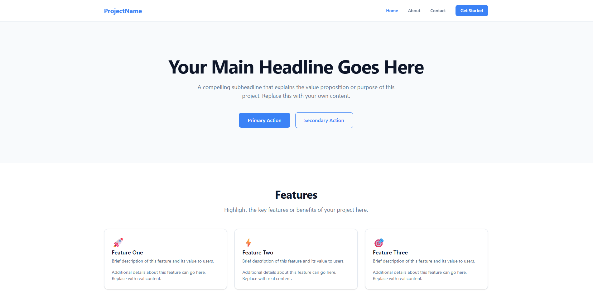

# React + Vite + Tailwind CSS Starter

A minimal, reusable starter template for building modern React applications.



## Quick Start

```bash
# Clone the template
git clone https://github.com/YOUR_USERNAME/react-vite-starter.git my-project
cd my-project

# Install dependencies
npm install

# Start development server
npm run dev
```

## What's Included

- ⚡ **Vite 6** — Fast dev server and optimized builds
- ⚛️ **React 19** — Latest React with hooks
- 🎨 **Tailwind CSS v4** — Utility-first CSS with CSS-based config
- 🧭 **React Router v7** — Client-side routing with nested layouts
- 📐 **ESLint** — Code quality with React-specific rules
- 📱 **Responsive Layout** — Mobile-first header with hamburger menu
- 🧩 **Reusable Components** — Button, Card, Section primitives
- 📝 **JSDoc Documented** — Every component, hook, utility, and handler is documented with JSDoc
- 🤖 **Claude Code Ready** — `CLAUDE.md` with full project context

## Project Structure

```
src/
├── components/
│   ├── layout/      # Header, Footer, Layout wrapper
│   ├── ui/          # Reusable primitives (Button, Card, Section)
│   └── sections/    # Page content blocks (Hero, Features, CTA)
├── pages/           # Route-level page components
├── hooks/           # Custom React hooks
├── utils/           # Helper functions
├── context/         # React Context providers
├── styles/          # Global CSS + Tailwind theme
└── assets/          # Static images and icons
```

## Pages

| Page | Route | Description |
|------|-------|-------------|
| **HomePage** | `/` | Landing page composed of Hero banner, Features card grid, and Call-to-Action section |
| **AboutPage** | `/about` | Placeholder about page ready to be customized |
| **ContactPage** | `/contact` | Contact form with controlled inputs (no backend — add your own submission logic) |
| **NotFoundPage** | `*` | 404 catch-all page for unmatched routes |

## Layout & Components

### Layout
All pages share a common **Layout** wrapper that renders a persistent **Header** and **Footer** around the active route (via React Router's `<Outlet />`).

- **Header** — Responsive navigation bar with a mobile hamburger menu and links to all pages
- **Footer** — Site footer with organized link columns and branding

### Section Components
Pre-built content blocks used to compose pages:

- **Hero** — Full-width banner with headline, subtitle, and CTA buttons
- **Features** — Responsive card grid for highlighting key features
- **CallToAction** — Standout banner section to drive user action

### UI Primitives
Reusable building blocks that section and page components are built from:

- **Button** — Polymorphic component that renders as a `<button>`, React Router `<Link>`, or `<a>` tag depending on props
- **Card** — Composable card with `CardHeader`, `CardTitle`, `CardDescription`, and `CardContent` sub-components
- **Section** — Page section wrapper with an optional `SectionHeader`

## Documentation

All source files include **JSDoc comments** documenting every component, function, hook, event handler, and data constant. This provides:

- Descriptions of what each component renders and its role in the architecture
- `@param` tags for all props with types and default values
- `@returns` tags specifying the return type
- Type annotations on data arrays and configuration objects

IDEs like VS Code will surface these docs as inline tooltips and autocomplete hints.

## Claude Code

[Claude Code](https://docs.anthropic.com/en/docs/claude-code) is Anthropic's official CLI tool that brings Claude AI directly into your terminal. It can read, write, and edit files in your project, run commands, search your codebase, and help you build features, fix bugs, or refactor code — all through natural language conversation.

### Why this template includes it

This project ships with a `CLAUDE.md` file in the root. When you run Claude Code inside this directory, it automatically reads `CLAUDE.md` to understand the tech stack, project structure, design principles, component conventions, and available scripts. This means Claude can give accurate, context-aware assistance from the first prompt.

### Setup

1. **Install Claude Code** (requires Node.js 18+):
   ```bash
   npm install -g @anthropic-ai/claude-code
   ```

2. **Authenticate** — run `claude` for the first time and follow the login prompt to connect your Anthropic account.

3. **Use it in this project** — navigate to the project root and start a session:
   ```bash
   cd my-project
   claude
   ```

4. **Ask it anything** about the project, for example:
   - *"Add a new Services page with a pricing grid"*
   - *"Create a reusable Modal component in components/ui/"*
   - *"Fix the mobile menu so it closes when a link is clicked"*

Claude Code will read the `CLAUDE.md` context and work with the existing structure, conventions, and design principles defined in this template.

## Customization

See `CLAUDE.md` for detailed project documentation and customization instructions.

## Scripts

| Command | Description |
|---------|-------------|
| `npm run dev` | Start dev server on port 4829 |
| `npm run build` | Build for production |
| `npm run preview` | Preview production build |
| `npm run lint` | Run ESLint |

## License

MIT
